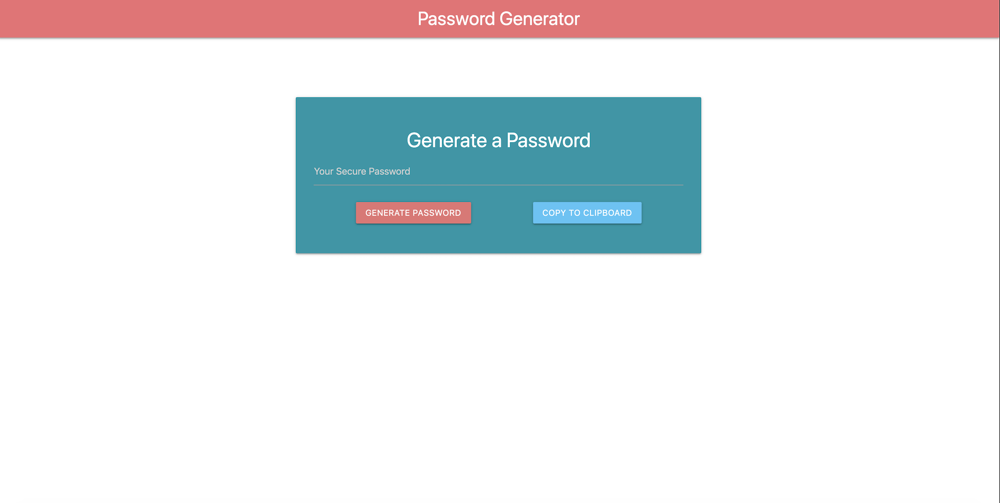

# Password Generator

## Description

This application is password generator built with:

-   HTML5
-   Materialize-css
-   Javascript

User can be used as a widget implemented on the "sign-up" page of a web page or any section that could use a password generator.

With this app users can:

-   Generate a password that contains numbers, uppercase letters, lowercase letters and special characters.
-   Copy the generated password to clipboard.

---

© 2019 Pablo Motta
